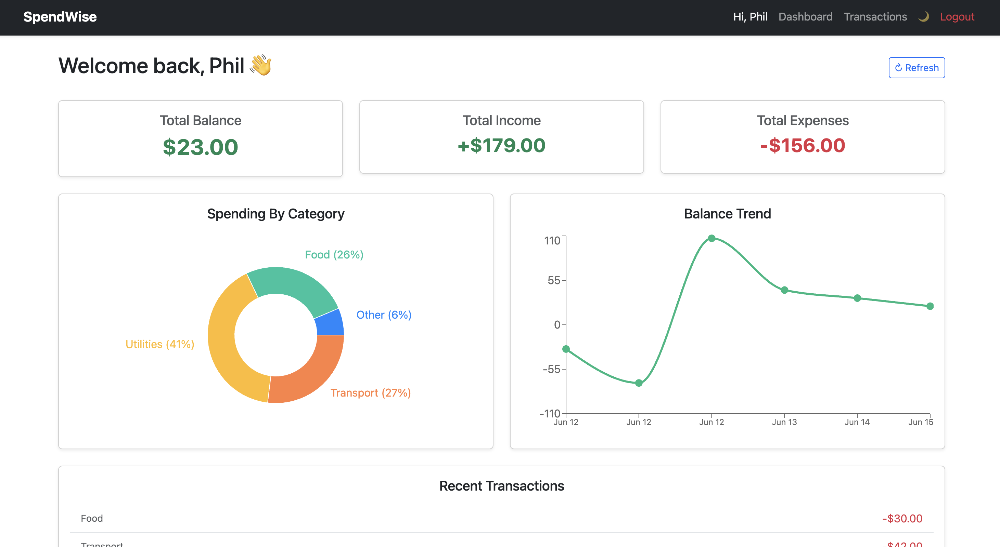
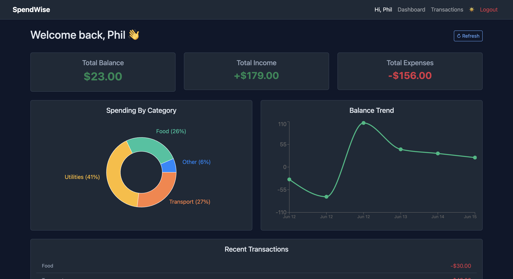
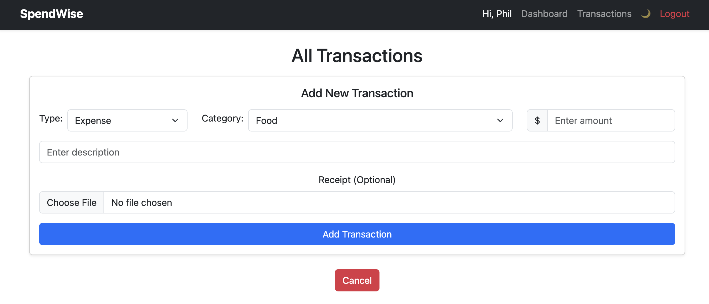
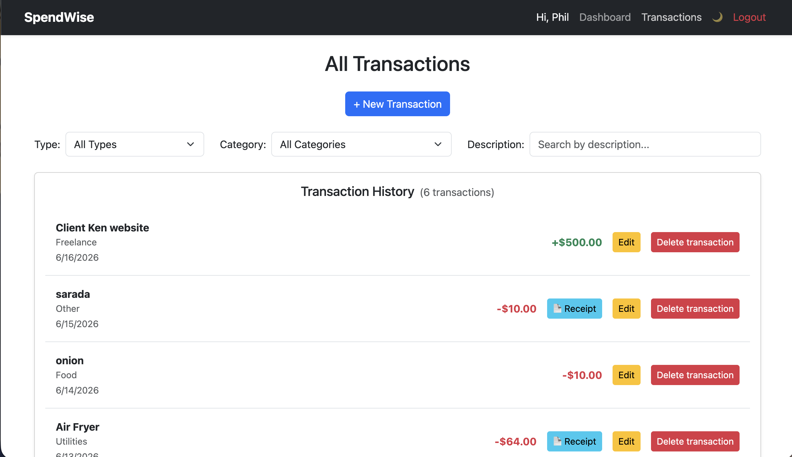

# SpendWise 💰

A full-stack personal finance tracker built with the MERN stack, featuring JWT authentication, interactive charts, dark mode, and AWS S3 receipt uploads.

**[Live Demo](https://your-vercel-frontend.vercel.app)**  
**[Backend API](https://your-render-backend.onrender.com)**

## ✨ Key Features

- **Secure Authentication** – Register/Login with JWT + protected routes
- **Full Transaction CRUD** – Create, read, update, delete expenses & income
- **Beautiful Dashboard** – Balance cards, Spending by Category (donut chart), Balance Trend (line chart)
- **Advanced Filtering** – Filter by type, category, and search by description
- **Receipt Upload** – Store receipt images securely in **AWS S3**
- **Dark/Light Mode** – Toggle with system preference support
- **Responsive Design** – Built with Bootstrap

## 🛠 Tech Stack

**Frontend:** React 18 + Vite, React Router, Context API, Recharts, Bootstrap 5  
**Backend:** Node.js, Express, MongoDB + Mongoose, JWT Authentication  
**Cloud:** AWS S3 (receipt storage with Multer)  
**Deployment:** Vercel (Frontend) + Render (Backend)

## 📸 Screenshots

### Dashboard (Light Mode)


### Dashboard (Dark Mode)


### Receipt Upload Feature


### Transaction List


## 🚀 Quick Start

```bash
# Clone the repo
git clone https://github.com/PhilBKouokam/spendwise.git
cd spendwise

# Backend
cd backend
npm install
cp .env.example .env        # Add your credentials
npm run dev

# Frontend (new terminal)
cd frontend
npm install
npm run dev

📝 What I Learned / Highlights

Built a complete JWT authentication system with protected routes
Implemented secure file uploads to AWS S3 using Multer and the AWS SDK v3
Managed complex global state using React Context API
Created meaningful data visualizations with Recharts
Focused on clean architecture and separation of concerns
